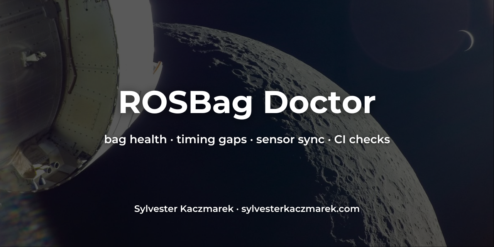

# ROSBag Doctor



[](https://github.com/sylvesterkaczmarek/rosbag-doctor/actions/workflows/ci.yml)


Find bad ROS 2 recordings before they become bad datasets. `rosbag-doctor` checks SQLite3 and MCAP bags for timing gaps, bad rates, timestamp problems, incomplete topic coverage, and configured sensor-sync limits. It works directly on bag files and does not require a ROS installation.

## At a glance

```bash
rosbag-doctor my_recording/ --config doctor.yaml
```

```text
ROSBag Doctor  FAIL
sqlite3 · 1 file(s) · 773 messages · 5.99 s

Topic               Messages      Rate   Max gap   p95 jitter   Coverage
/camera/image_raw         173   28.83 Hz  266.7 ms      0.0 ms      99.6%
/imu                      600  100.00 Hz   10.0 ms      0.0 ms     100.0%

Sensor sync
camera-imu  p95 offset 3.67 ms  max offset 3.67 ms

1 error, 0 warnings
✗ /camera/image_raw  Maximum gap 266.7 ms exceeds 100.0 ms
```

The example above comes from the checked-in demo recording. The camera stream deliberately loses several frames; the IMU remains healthy.

## What it checks

Without a config file, ROSBag Doctor performs conservative checks that are useful on unknown recordings:

- timestamp regressions
- repeated timestamps
- timestamp zeroes
- unusually large gaps on otherwise regular streams
- empty bags and topics

With a YAML policy, it can enforce:

- required topics and topic globs
- expected rate with tolerance
- maximum message gap
- p95 timing jitter
- minimum recording coverage
- minimum message count
- maximum topic start delay or early stop
- p95 and worst-case timestamp offset across sensor streams
- minimum or maximum bag duration

Every check can be exported as JSON, and a failing policy returns exit code `1` for CI.

## Supported inputs

- ROS 2 SQLite3 bags (`.db3` and `.sqlite3`)
- MCAP files (`.mcap`)
- split rosbag2 directories described by `metadata.yaml`
- direct bag files when `metadata.yaml` is unavailable

ROSBag Doctor reads recording timestamps and topic metadata. It does not deserialize ROS messages, so it can inspect timing without having the message packages installed.

## Install

From a clone:

```bash
git clone https://github.com/sylvesterkaczmarek/rosbag-doctor.git
cd rosbag-doctor
python -m pip install .
```

For development:

```bash
python -m pip install -e '.[dev]'
pytest
```

## Check a bag

```bash
rosbag-doctor ./rosbag2_2026_08_09-00_15_42
```

Use a policy when the expected recording contract is known:

```bash
rosbag-doctor ./run-042 --config doctor.yaml
```

Write a JSON report:

```bash
rosbag-doctor ./run-042 --config doctor.yaml --json report.json
```

Print JSON to stdout:

```bash
rosbag-doctor ./run-042 --format json
```

Treat warnings as failures:

```bash
rosbag-doctor ./run-042 --strict
```

Exit codes:

| Code | Meaning |
|---:|---|
| `0` | pass, or warnings without `--strict` |
| `1` | one or more health checks failed |
| `2` | bad input, unreadable bag, or invalid config |

## Define expected recording quality

```yaml
version: 1

topics:
  /imu:
    required: true
    rate_hz: 200
    rate_tolerance: 0.05
    max_gap_ms: 20
    max_jitter_ms: 2
    min_coverage: 0.98

  /camera/*:
    required: true
    rate_hz: 30
    rate_tolerance: 0.10
    max_gap_ms: 100

sync:
  - name: camera-imu
    reference: /camera/image_raw
    topics: [/camera/image_raw, /imu]
    max_p95_offset_ms: 8
    max_offset_ms: 20
```

Exact topic rules take precedence over globs. See [`docs/configuration.md`](docs/configuration.md) for all fields.

## Make a baseline from a good run

A known-good bag can seed a policy:

```bash
rosbag-doctor baseline ./known-good-run -o doctor.yaml
```

The generated file records the observed topics, rates, coverage, and gap limits with headroom. Review it once, commit it with the robot software, then use it on later recordings.

## Compare two runs

```bash
rosbag-doctor compare ./run-before-change ./run-after-change
```

This reports added and removed topics plus changes in effective rate and maximum gap. JSON output is also available:

```bash
rosbag-doctor compare ./before ./after --format json
```

## Use it in CI

```yaml
- name: Check recorded test data
  run: |
    rosbag-doctor artifacts/test-run \
      --config config/rosbag-doctor.yaml \
      --json rosbag-doctor-report.json
```

A failed recording returns a non-zero exit code, so a hardware-in-the-loop or simulation pipeline can stop before a broken bag is uploaded or used for evaluation.

See [`docs/ci.md`](docs/ci.md) for a complete example.

## Demo without ROS

The repository includes a small generator that writes a rosbag2-compatible SQLite database with a deliberate camera dropout:

```bash
python examples/make_demo_bag.py .demo-bag
rosbag-doctor .demo-bag --config examples/doctor.yaml
```

The command should fail because the configured camera gap limit is exceeded.

## How the numbers are calculated

For each topic, ROSBag Doctor keeps the recorded timestamp sequence and calculates:

- **effective rate** as `(message_count - 1) / recorded_duration`
- **median period** from positive consecutive timestamp differences
- **maximum gap** from the largest positive consecutive difference
- **p95 jitter** from absolute deviation around the median period
- **coverage** as the topic time span divided by the bag time span
- **sensor offset** using nearest timestamps to the configured reference stream

Timestamp regressions are checked in recorded order rather than hidden by sorting the bag first.

See [`docs/checks.md`](docs/checks.md) for definitions and issue codes.

## Scope

ROSBag Doctor checks the health of the recording timeline. It does not currently inspect message payloads, image corruption, ROS header stamps, TF graph connectivity, calibration correctness, or whether sensor values are physically plausible.

That distinction is intentional. The tool can run on a laptop or CI runner without ROS message packages and can catch recording failures before payload-specific analysis begins.

See [`docs/formats.md`](docs/formats.md) and [`docs/limitations.md`](docs/limitations.md).

## Repository layout

```text
rosbag-doctor/
├── .github/workflows/       # CI
├── assets/social/           # repository social card
├── docs/                    # checks, config, CI, formats and limitations
├── examples/                # demo bag generator and policy
├── src/rosbag_doctor/       # readers, statistics, checks and CLI
├── tests/                   # SQLite, MCAP, policy, baseline and CLI tests
├── CITATION.cff
├── LICENSE
├── Makefile
├── pyproject.toml
└── README.md
```

## Cite this repository

If you use or adapt this repository, please cite:

> Kaczmarek, S. (2026). *ROSBag Doctor*. GitHub. https://github.com/sylvesterkaczmarek/rosbag-doctor

```bibtex
@software{Kaczmarek_2026_ROSBag_Doctor,
  author = {Sylvester Kaczmarek},
  title  = {{ROSBag Doctor}},
  year   = {2026},
  url    = {https://github.com/sylvesterkaczmarek/rosbag-doctor}
}
```

## License

MIT. See [LICENSE](LICENSE).

© **Sylvester Kaczmarek** · [https://www.sylvesterkaczmarek.com](https://www.sylvesterkaczmarek.com)
